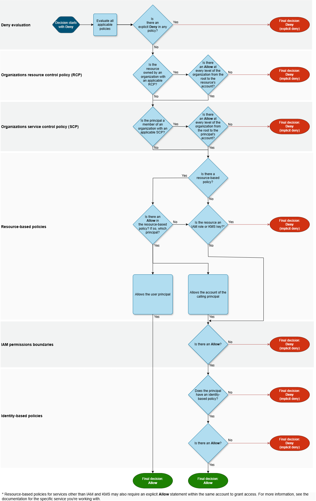

## 1. Policy Summaries (AWS Console UI)

JSON policies can be massive and difficult to read. To help administrators, the AWS Management Console automatically translates your raw JSON into a human-readable **Policy Summary**. 

As shown in your image, it drills down in a strict hierarchy:
1.  **Policy Summary (Services):** At the highest level, it shows a list of the AWS *Services* the policy affects (e.g., S3, EC2).
2.  **Service Summary (Actions):** When you click into a specific service, it breaks down the specific *Actions* (API calls) that are allowed or denied (e.g., `ListBucket`, `GetObject`).
3.  **Action Summary (Resources):** Finally, clicking an action reveals the specific *Resources* (ARNs) that the action is permitted to interact with.

## 2. IAM Policy Evaluation Logic (The Flowchart)

This is the mathematical engine of AWS Security. When your Python application makes an API call to AWS, AWS evaluates the request against all attached policies using this exact flow:

1.  **Decision Starts at Deny:** Also known as **Implicit Deny** or **Default Deny**. If you create a brand new IAM User, they have access to absolutely nothing. 
2.  **Evaluate all applicable policies:** AWS gathers your Identity-based policies (attached to the IAM User/Role) AND Resource-based policies (attached directly to resources like S3 buckets or SQS queues).
3.  **Is there an Explicit Deny?** AWS checks every single statement. If *any* statement explicitly denies the action, the evaluation STOPS. **Explicit Deny ALWAYS wins!** Final decision: Deny.
4.  **Is there an Allow?** If there is no explicit deny, AWS checks for an explicit allow anywhere in the policies. If found, Final decision: Allow.
5.  **If neither?** If there is no Explicit Deny, but also no Explicit Allow, the system falls back to step 1. Final decision: Deny.


---

## 💡 Practical Developer Tip (Python / Boto3)

Did you know you can programmatically test your IAM policies before you deploy your code? As a developer, you don't have to guess if your policy evaluation will work. You can use the `iam.simulate_principal_policy()` API in Python to run a dry-run of the evaluation logic!

```python
import boto3

iam_client = boto3.client('iam')

# Test if an IAM user has permission to read a specific S3 bucket
response = iam_client.simulate_principal_policy(
    PolicySourceArn='arn:aws:iam::123456789012:user/MyDeveloperUser',
    ActionNames=['s3:GetObject'],
    ResourceArns=['arn:aws:s3:::my-secret-company-data/*']
)

# This will tell you 'allowed', 'explicitDeny', or 'implicitDeny'
evaluation_result = response['EvaluationResults'][0]['EvalDecision']
print(f"Can the user access the bucket? Result: {evaluation_result}")
```

---

# Interview Preparation: Policy Evaluation

## Summary
Interviewers love giving you tricky scenario-based questions to see if you actually understand the "Explicit Deny Wins" rule. They will intentionally try to confuse you by mixing Identity policies and Resource policies.

## Q&A Details

**Q1: You have an S3 bucket with a Resource Policy that explicitly ALLOWS public access. However, an IAM User has an Identity Policy that explicitly DENIES access to all S3 buckets. If that IAM User tries to read a file in that bucket, what happens?**
* **Answer:** The request will be denied. It does not matter that the S3 Bucket Policy allows public access. During the policy evaluation logic, AWS combines all applicable policies. Because an Explicit Deny is present in the user's Identity Policy, it overrides all Allows globally. Explicit Deny *always* wins.

**Q2: A developer creates an IAM User but forgets to attach any policies. The developer tries to list EC2 instances. What is the result and why?**
* **Answer:** The request is denied due to an Implicit Deny (Default Deny). By default, the AWS evaluation logic starts at "Deny". Because there is no Explicit Allow attached to the user to override that default state, the request is rejected.

**Q3: How do Resource-based policies interact with Identity-based policies? Do you need an Allow in both?**
* **Answer:** Assuming they are in the *same* AWS account, you only need an Explicit Allow in **one** of them (either the Identity policy OR the Resource policy), as long as there is no Explicit Deny in either. If it is cross-account (different AWS accounts), you must have an Explicit Allow in **both** the Identity policy of the caller and the Resource policy of the target.
