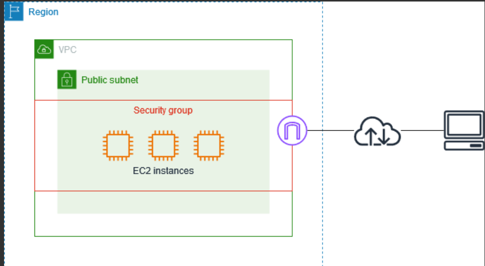

# EC2 Part 3: Security Groups (The Virtual Firewall)

A Security Group (SG) is a virtual firewall attached at the instance level (specifically, to the Elastic Network Interface or ENI of the instance). It controls exactly what network traffic is allowed to flow into (Inbound) and out of (Outbound) your EC2 instance.


---

## 1. Core Rules & Default Behaviors

AWS loves testing you on the default behaviors of Security Groups. Memorize these facts:

* **Allow Rules Only:** Security Groups *only* contain allow rules. You cannot write a "deny" rule in a Security Group (that is what Network ACLs are for). If a specific port or IP is not explicitly allowed, the traffic is dropped.
* **Stateful Filtering:** This is critical. SGs are **stateful**. This means if an inbound request is authorized to come in, the response to that request is *automatically* allowed back out, regardless of the outbound rules.
* **Default Inbound Behavior:** When you create a new SG, ALL inbound traffic is **blocked** by default.
* **Default Outbound Behavior:** When you create a new SG, ALL outbound traffic is **authorized** by default (the instance can talk to the internet).

**Timeouts vs. Connection Refused:**

* If your browser or terminal just hangs and gives a **"Timeout"**, the traffic is being *blocked* by a Security Group.
* If you get a **"Connection Refused"** error immediately, the Security Group *allowed* the traffic through, but the application (like Apache or Node.js) on the server isn't running or listening on that port.

---

## 2. Important Ports to Memorize

For the exams, you must know these default ports:

| Port | Protocol | Use Case |
| --- | --- | --- |
| **22** | SSH / SFTP | Secure Shell. Used to log into Linux instances via the terminal. |
| **21** | FTP | File Transfer Protocol (insecure, rarely used now). |
| **80** | HTTP | Unsecured web traffic. |
| **443** | HTTPS | Secured web traffic (encrypted with SSL/TLS). |
| **3389** | RDP | Remote Desktop Protocol. Used to log into a visual desktop on Windows instances. |

---

## 3. The Advanced "Pro-Tip": Security Group Referencing

Instead of authorizing an inbound rule based on an IP address (e.g., `10.0.0.5/32`), you can authorize an inbound rule based on the **ID of another Security Group** (e.g., `sg-abc123`).

**Why is this powerful?**
Imagine you have an Application server and a Database server. The Database should only accept traffic from the Application server.

Instead of trying to track the Application server's IP address (which might change if the server restarts or scales up), you attach **"App-SG"** to the application server. Then, in the **"DB-SG"**, you add an inbound rule: *Allow Port 5432 from source "App-SG"*.

Now, any EC2 instance that has the "App-SG" attached can instantly talk to the database.

---

> 💡 **Practical Developer Tip (Python / Boto3)**
> As a developer, you might want to automate tightening your security. Here is a `boto3` script that looks for any Security Group that leaves SSH (Port 22) wide open to the entire internet (`0.0.0.0/0`), which is a major security risk!

```python
import boto3

ec2_client = boto3.client('ec2', region_name='us-east-1')

# Describe all security groups
response = ec2_client.describe_security_groups()

print("--- Checking for Open SSH (Port 22) ---")
for sg in response['SecurityGroups']:
    sg_name = sg['GroupName']
    sg_id = sg['GroupId']
    
    # Check the inbound rules
    for rule in sg['IpPermissions']:
        # If the rule applies to port 22 or all ports
        if rule.get('FromPort') == 22 or rule.get('IpProtocol') == '-1':
            for ip_range in rule.get('IpRanges', []):
                if ip_range.get('CidrIp') == '0.0.0.0/0':
                    print(f"🚨 WARNING: Security Group '{sg_name}' ({sg_id}) has SSH open to the world!")

```

---

## Interview Preparation: Security Groups

### Summary

Interviewers will test your troubleshooting skills. They will give you scenarios where two servers can't communicate or a web server isn't reachable, and expect you to immediately point to Security Group inbound/outbound rules or the stateful nature of the firewall.

### Q&A Details

**Q1: Our developers launched a new Linux EC2 instance and installed a Python web app listening on Port 80. When they try to load the IP address in Chrome, the browser spins for 30 seconds and says "Connection Timed Out." What is the first thing you check?**
**Answer:** A "Timeout" almost always indicates a firewall block. I would immediately check the Security Group attached to that EC2 instance. I expect to find that there is no Inbound Rule allowing traffic on Port 80 (HTTP) from `0.0.0.0/0` (the internet).

**Q2: You have an EC2 instance that needs to download software updates from the internet. You have verified that the instance is in a public subnet with an Internet Gateway. However, you strictly removed all Outbound rules from the Security Group to be safe. Will the updates work?**
**Answer:** No, the updates will fail. While Security Groups are stateful, that only applies to return traffic for *inbound* requests. Because the EC2 instance is initiating the *outbound* request to the update servers, it requires an explicit Outbound Allow rule (typically `0.0.0.0/0` on Port 80 and 443) to reach the internet.

**Q3: We have an Auto Scaling Group that spins up dozens of identical Python web servers behind an Elastic Load Balancer (ELB). How do we configure the Security Group on our PostgreSQL database to ensure only these dynamic web servers can reach it?**
**Answer:** We should use **Security Group Referencing**. We will create a specific Security Group (e.g., `WebServer-SG`) and attach it to the EC2 instances in the Auto Scaling Group. Then, on the database's Security Group, we create an Inbound rule for Port 5432, and instead of listing IP addresses, we set the source to the ID of the `WebServer-SG`. This ensures the database securely accepts traffic from the web servers, no matter how many instances scale up or down.