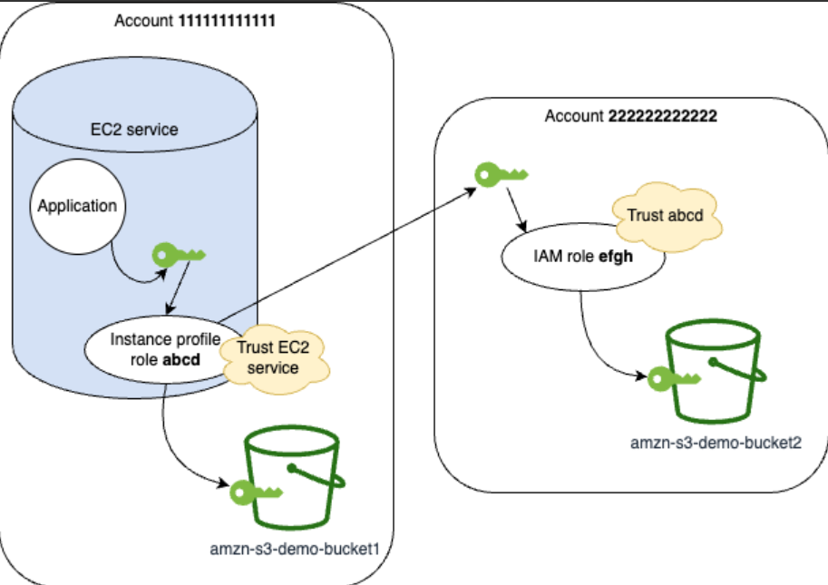

# Practical Guide: Attaching IAM Roles to EC2

When you launch an EC2 instance, it is essentially a blank computer. If you try to run an AWS CLI command (like `aws s3 ls`) or run a Python `boto3` script to talk to an AWS service, it will fail with an "Access Denied" or "Unable to locate credentials" error.

---

## 1. The Anti-Pattern (What NEVER to do)

Your first instinct might be to run `aws configure` in the EC2 terminal and paste in your personal AWS Access Key ID and Secret Access Key.

**DO NOT DO THIS!**

* **The Risk:** If you put your permanent keys on a server, anyone else who logs into that server (or any hacker who breaches it) can instantly steal your keys and compromise your entire AWS account.
* **The Rule:** Never hardcode or manually configure long-term access keys on an Amazon EC2 instance.

---

## 2. The Best Practice: IAM Roles (Instance Profiles)



The secure, AWS-recommended way to give an EC2 instance permissions is to attach an **IAM Role**.

When you attach a Role to an EC2 instance, AWS creates an **Instance Profile** behind the scenes. This profile securely delivers temporary, automatically rotating credentials directly to the server.

**How to Attach a Role to a Running Instance:**
You do *not* need to stop an instance to give it permissions!

1. Go to the **EC2 Console** > **Instances**.
2. Select your running instance.
3. Click **Actions** > **Security** > **Modify IAM role**.
4. Select the desired IAM Role from the dropdown (e.g., `DemoRoleForEC2`) and click **Save**.

*Result:* If you immediately type `aws s3 ls` in the EC2 terminal, it will instantly work. No `aws configure` required!

---

## 3. Dynamic Policy Updates

IAM Roles are highly dynamic.

* If you modify the IAM Policy attached to the role (e.g., removing Amazon S3 access), the EC2 instance will instantly lose that access.
* You do **not** need to restart or reboot the EC2 instance for IAM policy changes to take effect. It evaluates the policy in real-time.

---

> 💡 **Practical Developer Tip (Python / Boto3)**
> As an AWS Python Developer, you will love IAM Roles. Why? Because `boto3` is programmed to automatically look for them!
> When your Python code runs on an EC2 instance that has an IAM Role attached, you do not need to write any code to fetch the temporary credentials. Boto3 queries the **Instance Metadata Service (IMDS)** automatically.

```python
import boto3

# This is all the code you need! 
# Boto3 detects it is running on EC2, finds the attached IAM Role, 
# and automatically fetches the temporary security tokens for you.
ec2_client = boto3.client('ec2', region_name='us-east-1')

# Describe instances securely
response = ec2_client.describe_instances()
print("Successfully authenticated and fetched instances!")

```

---

## Interview Preparation: EC2 and IAM Roles

### Summary

Interviewers will test you heavily on this concept to ensure you have a secure engineering mindset. They want to hear you confidently state that hardcoding credentials is a severe anti-pattern and that IAM Roles are the only acceptable way to grant AWS services permissions.

### Q&A Details

**Q1: You log into an EC2 instance created by a junior developer and notice a `~/.aws/credentials` file containing Access Keys. What are the security implications, and how do you remediate this?**
**Answer:** Storing long-term Access Keys on an EC2 instance is a major security vulnerability because any user or compromised application on that server can extract the keys and use them elsewhere. To remediate this, I would immediately delete the credentials file, deactivate/rotate those specific keys in IAM, and instead attach an IAM Role to the EC2 instance with the precise permissions (Least Privilege) the application needs.

**Q2: You have an EC2 instance with an attached IAM Role that allows Read access to S3. Your manager asks you to update the permissions to allow Write access as well. Will you need to reboot the EC2 instance for the new permissions to take effect?**
**Answer:** No, a reboot is not required. IAM policy evaluations happen in real-time. As soon as the IAM Policy attached to the role is updated to allow S3 Write access, the application running on the EC2 instance will immediately be able to perform the new actions (though there may be a slight AWS backend propagation delay of a few seconds).

**Q3: How exactly does the AWS CLI or `boto3` SDK running on an EC2 instance retrieve the temporary credentials from the attached IAM Role?**
**Answer:** The SDK/CLI retrieves the credentials by querying the EC2 Instance Metadata Service (IMDS). The SDK automatically makes a local HTTP GET request to a special, non-routable IP address (`[http://169.254.169.254/latest/meta-data/iam/security-credentials/](http://169.254.169.254/latest/meta-data/iam/security-credentials/)`) to fetch the temporary Access Key, Secret Key, and Session Token provided by AWS STS.