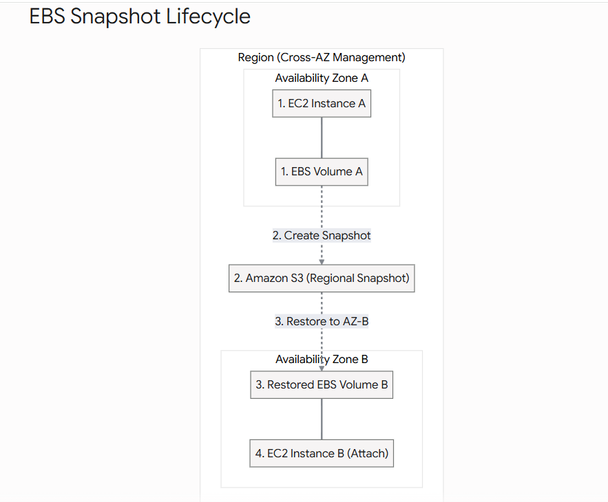

# EC2 Storage: Elastic Block Store (EBS) & Snapshots

When you launch an EC2 instance, it needs a hard drive to store its operating system and your data. In AWS, this is primarily handled by **EBS (Elastic Block Store)**.

---

## 1. What is an EBS Volume?

An EBS volume is a network-attached drive that you can attach to your EC2 instances while they run.

* **The Analogy:** Think of an EBS volume as a "Network USB Stick." You can plug it into a computer, save data, unplug it, and plug it into a different computer. Because it is network-attached, there is a slight latency compared to a physical drive bolted into the motherboard.
* **Persistence:** They allow your data to persist even if the EC2 instance is stopped or terminated.
* **1-to-1 Relationship:** Standard EBS volumes can only be attached to one EC2 instance at a time. *(Note: It is possible to attach multiple EBS volumes to a single EC2 instance, and with specific Multi-Attach volume types, attach one volume to multiple instances).*
* **Availability Zone Lock:** EBS volumes are bound to a specific Availability Zone (AZ). A volume created in `us-east-1a` cannot be directly attached to an EC2 instance in `us-east-1b`.
* **Provisioned Capacity:** When you create an EBS volume, you provision its size (in GB) and its speed (IOPS). You are billed for the provisioned capacity, regardless of how much data you actually put on it.

---

## 2. The "Delete on Termination" Attribute

This is a massive "gotcha" for both developers and the AWS exams. It controls what happens to the EBS volume when the attached EC2 instance is terminated.

* **Root Volume (The OS Drive):** By default, the Delete on Termination attribute is **ENABLED**. If you delete the EC2 instance, the root hard drive is destroyed with it.
* **Additional Attached Volumes:** By default, the Delete on Termination attribute is **DISABLED**. If you delete the EC2 instance, any extra EBS volumes you attached will survive and remain in your account (costing you money until you manually delete them).

> **Tip:** You can change this behavior in the AWS Console during launch if you want to preserve the root volume after termination.

---

## 3. EBS Snapshots (The Backup Strategy)

A Snapshot is an incremental backup of your EBS volume at a specific point in time.

**The Cross-AZ Trick:** Because EBS volumes are locked to a single AZ, you use Snapshots to move them.

**Workflow:**

1. Take a snapshot of the volume in AZ A.
2. Restore the snapshot into a brand new volume, specifying AZ B as the target.
3. Attach the new volume to your instance in AZ B.

You can also copy Snapshots across different AWS Regions (great for Disaster Recovery).


---

## 4. Advanced Snapshot Features

* **EBS Snapshot Archive:** If you need to keep a snapshot for compliance reasons but don't need immediate access to it, you can move it to the Archive tier. It is up to 75% cheaper, but it takes 24 to 72 hours to restore it.
* **Recycle Bin:** Protects against accidental deletion. If you delete a snapshot, it goes to the Recycle Bin for a configured period (1 day to 1 year) where it can be fully recovered before permanent deletion.
* **Fast Snapshot Restore (FSR):** Normally, restoring a snapshot into a volume has a "lazy loading" penalty (the first time you read a block, it is slow). FSR forces a full initialization of the snapshot so the volume has maximum performance instantly. It is very expensive.

---

> 💡 **Practical Developer Tip (Python / Boto3)**
> As a developer, you should never rely on clicking a button in the console to back up your database drives. You can use Python to automate taking snapshots of your mission-critical EBS volumes!

```python
import boto3

ec2_client = boto3.client('ec2', region_name='us-east-1')

# The ID of the EBS Volume you want to back up
volume_id = 'vol-0abcd1234efgh5678'

try:
    response = ec2_client.create_snapshot(
        VolumeId=volume_id,
        Description='Automated Nightly Database Backup',
        TagSpecifications=[
            {
                'ResourceType': 'snapshot',
                'Tags': [{'Key': 'Environment', 'Value': 'Production'}]
            }
        ]
    )
    
    snapshot_id = response['SnapshotId']
    print(f"✅ Backup successful! Snapshot {snapshot_id} is currently in state: {response['State']}")

except Exception as e:
    print(f"❌ Failed to create snapshot: {e}")

```

---

## Interview Preparation: EBS Volumes & Snapshots

### Summary

Interviewers will test your knowledge on the limitations of EBS (AZ locks) and how to overcome them. They will also test your understanding of what happens to data when an instance is destroyed.

### Q&A Details

**Q1: We have an EC2 instance running a MySQL database in `us-west-2a`. The underlying hardware fails and the instance is unreachable. We need to spin up a replacement instance in `us-west-2b` and attach the database's EBS volume to it immediately. How do we do this?**
**Answer:** You cannot attach an EBS volume directly to an instance in a different Availability Zone. We must first take an EBS Snapshot of the volume in `us-west-2a`. Then, we restore that snapshot to create a brand new EBS volume, specifying `us-west-2b` as the target Availability Zone. Finally, we attach the newly created volume to the new EC2 instance.

**Q2: A developer terminated an EC2 instance to save money over the weekend. On Monday, they realize the custom logs stored on the root EBS volume are gone, but the secondary data volume they manually attached is still available in the account. Why did this happen?**
**Answer:** This is due to the default *Delete on Termination* behavior. By default, AWS deletes the root EBS volume when an EC2 instance is terminated. However, any additional, manually attached EBS volumes have Delete on Termination disabled by default, which is why the secondary volume survived.

**Q3: We have a 5TB EBS Snapshot that we need to restore to a new volume. The application requires immediate, maximum I/O performance the second it boots, but the engineering team noted that reading data from the restored volume is initially very slow. How do we fix this?**
**Answer:** Restored EBS volumes pull data from S3 lazily, meaning the first time a block of data is accessed, there is a latency penalty. To fix this, we should enable **Fast Snapshot Restore (FSR)** on the snapshot. FSR forces a full initialization of the volume, guaranteeing maximum provisioned performance the moment the volume is created.