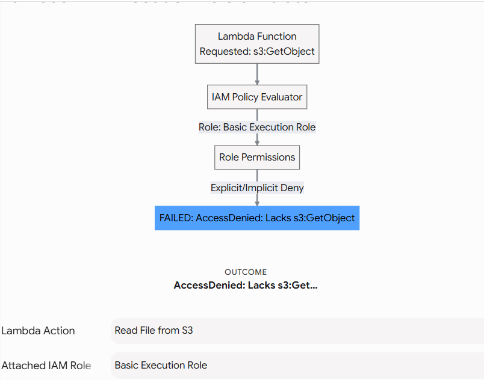
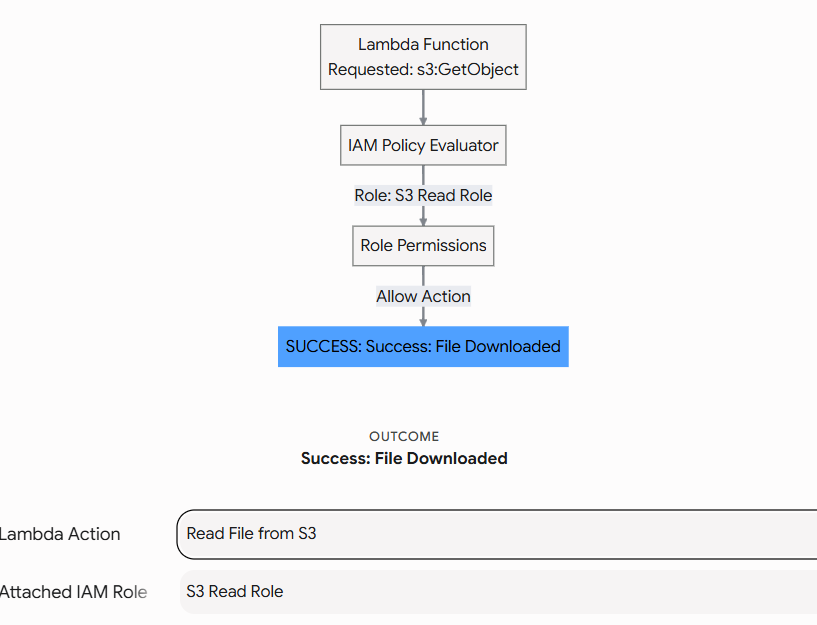

# AWS Lambda: Console & Execution Deep Dive

Creating an AWS Lambda function via the console helps demystify how serverless compute operates. You are not booting an operating system; you are simply providing code and defining the triggers that will execute it.

When designing scalable AI systems or modern backend APIs, Lambda is often used as a lightweight glue layer—for instance, to preprocess incoming data before passing it to heavier machine learning models, or to act as the backend for a FastAPI endpoint.

---

## 1. The Core Components of a Lambda Function

When you create a function in the AWS Console, you must configure a few foundational elements:

### A. The Handler Function

The handler is the specific method AWS Lambda calls to start execution. In Python, it is typically named `lambda_handler(event, context)`.

* **`event`:** A Python dictionary containing the data passed to the function (e.g., JSON from an API request, or metadata about an S3 file upload).
* **`context`:** An object containing runtime metadata (e.g., how much time is remaining before the function hits its timeout limit).

### B. The Execution Role (IAM)

A Lambda function runs securely isolated in the AWS Cloud. By default, it has **zero permissions** to interact with other AWS services.

* If your function needs to read a dataset from S3, you must attach an IAM Role to the Lambda function granting `s3:GetObject`.
* *Default Behavior:* AWS automatically creates a "Basic Lambda Execution Role" when you use the console wizard. This basic role only grants the function permission to write its logs to **Amazon CloudWatch**.

Basic Execution Role:


Reading files from s3 :





### C. CloudWatch Logs Integration

Because there is no physical server for you to SSH into, debugging is entirely dependent on logs.

* Every time your Lambda function uses a simple `print()` statement in Python, AWS automatically captures that output and sends it to an **Amazon CloudWatch Log Group** dedicated to that specific function.
* You can view successful executions, stack traces for code crashes, and exact billing duration metrics directly in the CloudWatch console.

---

## 2. Boto3 Implementation: Deploying & Invoking a Function

When integrating Python-centric backends or orchestrating an AI engineering pipeline, you might need to programmatically deploy and invoke a Lambda function.

Here is how you use `boto3` to package Python code, deploy it as a Lambda function, and invoke it with a simulated data payload.

```python
import boto3
import json
import zipfile
import os

region = 'us-east-1'
function_name = 'DataPreprocessingWorker'
# Replace with a valid IAM Role ARN in your account that has Basic Lambda Execution permissions
role_arn = 'arn:aws:iam::123456789012:role/BasicLambdaExecutionRole'

lambda_client = boto3.client('lambda', region_name=region)

def create_lambda_package():
    """Packages the Python code into a deployment ZIP file required by AWS Lambda."""
    # Simulated Python code for processing data in an ML/Backend pipeline
    python_code = """
import json

def lambda_handler(event, context):
    print("Received event payload:", event)
    
    # Simulate extracting data
    try:
        user_id = event['user_id']
        raw_data = event['data']
        
        # Simulate business logic (e.g., preprocessing for an AI model)
        processed_data = raw_data.upper()
        
        return {
            'statusCode': 200,
            'body': json.dumps({'user': user_id, 'status': 'processed', 'result': processed_data})
        }
    except KeyError as e:
        print(f"Missing required key in payload: {e}")
        raise Exception(f"Bad Request: Missing key {e}")
"""
    # Write to a file, then zip it
    with open('lambda_function.py', 'w') as f:
        f.write(python_code)
        
    with zipfile.ZipFile('function_payload.zip', 'w') as zipf:
        zipf.write('lambda_function.py')
        
    print("📦 Deployment package created.")

def deploy_function():
    """Deploys the ZIP file to AWS Lambda."""
    with open('function_payload.zip', 'rb') as f:
        zipped_code = f.read()

    print(f"🚀 Deploying Lambda function '{function_name}'...")
    try:
        response = lambda_client.create_function(
            FunctionName=function_name,
            Runtime='python3.10',
            Role=role_arn,
            Handler='lambda_function.lambda_handler', # filename.method_name
            Code={'ZipFile': zipped_code},
            Timeout=15, # Seconds
            MemorySize=128 # MB
        )
        print("✅ Deployment successful!")
    except lambda_client.exceptions.ResourceConflictException:
        print("ℹ️  Function already exists. (Use update_function_code instead for updates).")

def invoke_function():
    """Triggers the Lambda function synchronously with a simulated JSON payload."""
    payload = {
        "user_id": "usr-99",
        "data": "raw inference data"
    }
    
    print(f"⚡ Invoking '{function_name}' with payload: {payload}")
    
    response = lambda_client.invoke(
        FunctionName=function_name,
        InvocationType='RequestResponse', # Synchronous invocation
        Payload=json.dumps(payload)
    )
    
    # Read the streaming body response
    response_payload = json.loads(response['Payload'].read().decode("utf-8"))
    print(f"📥 Response from Lambda: {response_payload}")

if __name__ == "__main__":
    create_lambda_package()
    deploy_function()
    # Wait a few seconds for IAM role propagation if creating a role from scratch, 
    # then invoke the function.
    invoke_function()
    
    # Cleanup local files
    os.remove('lambda_function.py')
    os.remove('function_payload.zip')

```

---

## Interview Preparation: Lambda Execution & Troubleshooting

### Summary

Expect questions on how to troubleshoot serverless applications, how permissions operate in a serverless environment, and the purpose of the handler function.

### Q&A Details

**Q1: A developer has written a Python Lambda function that needs to read a configuration file from an Amazon S3 bucket. However, when the function is triggered, it crashes with an `AccessDenied` exception. The developer has full administrator access on their personal IAM user account. Why is the function failing?**
**Answer:** A Lambda function does not inherit the permissions of the developer who created it. It operates under its own **IAM Execution Role**. The developer must attach an IAM policy to the Lambda function's Execution Role that explicitly grants `s3:GetObject` permissions for that specific S3 bucket.

**Q2: You have deployed a Lambda function to process incoming API requests. Users report that the API occasionally returns 500 Internal Server Errors. Since there is no EC2 instance to SSH into, how do you investigate the root cause of these crashes?**
**Answer:** You must use **Amazon CloudWatch Logs**. AWS Lambda automatically integrates with CloudWatch and streams all `stdout` and `stderr` outputs (such as Python `print()` statements and unhandled exception stack traces) to a dedicated Log Group for that function. By reviewing the log streams that correspond to the times of the reported errors, you can identify the exact line of code causing the failure.

**Q3: When defining a Lambda function in Python, what is the purpose of the `event` parameter in the handler function?**
**Answer:** The `event` parameter is a Python dictionary that contains the payload or data triggering the Lambda function. Its structure varies entirely based on the invoking service. For example, if triggered by an S3 upload, the `event` will contain the bucket name and object key. If triggered directly via a synchronous API call, it will contain the custom JSON payload passed by the client.