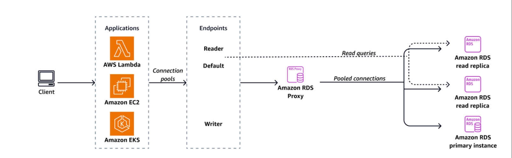

# AWS RDS Proxy

## 1. What is Amazon RDS Proxy?

Amazon RDS Proxy is a fully managed, highly available database proxy for Amazon RDS and Amazon Aurora.

* **The Problem:** Traditional relational databases have a fixed maximum number of connections. If an application opens and closes hundreds of connections per second, it burns through database CPU and RAM, eventually causing timeouts and "too many connections" errors.
* **The Solution:** RDS Proxy sits between your application and the database. It establishes a pool of persistent database connections and shares (multiplexes) them across your applications.
* **No Code Changes Required:** To use it, you simply change your application's database connection string to point to the RDS Proxy endpoint instead of the direct database instance endpoint.

**Supported Engines:** MySQL, PostgreSQL, MariaDB, Microsoft SQL Server, and Amazon Aurora (MySQL & PostgreSQL).

---

## 2. Core Benefits

Why add a proxy when you can connect to the database directly?

* **Connection Pooling:** Reduces stress on database resources (CPU/RAM) by minimizing the overhead of constantly opening and closing connections.
* **Faster Failovers (Up to 66% faster):** If an RDS or Aurora database undergoes a Multi-AZ failover (switching from Primary to Standby), RDS Proxy temporarily queues incoming requests and seamlessly routes them to the new database instance once it's up. The application never drops the connection, avoiding disruptive application-level errors.
* **Enhanced Security:**
* **Enforce IAM Authentication:** You can force all client applications to authenticate using AWS IAM roles instead of traditional database passwords.
* **Secrets Manager Integration:** RDS Proxy securely retrieves the underlying database credentials from AWS Secrets Manager to manage the real connections to the database.

* **Fully Serverless:** RDS Proxy is fully managed, auto-scaling, and highly available across multiple Availability Zones by default. You don't manage its underlying compute capacity.

---

## 3. The AWS Lambda Use Case (Exam Crucial!)

AWS loves testing the interaction between serverless applications (AWS Lambda) and relational databases (RDS).

* **The Serverless Database Problem:** AWS Lambda can scale to hundreds or thousands of concurrent executions in seconds. If 1,000 Lambda functions spin up simultaneously, each one attempts to open its own database connection. This creates a "connection storm" that will instantly exhaust the database's connection limit and crash the application.
* **The RDS Proxy Fix:** By placing RDS Proxy between Lambda and the database, the thousands of Lambda functions connect to the proxy, which absorbs the spike and multiplexes those requests over a smaller, stable pool of real database connections.

---

## 4. Network and Security Constraints

* **VPC Only:** RDS Proxy is **never publicly accessible**. It must be accessed from within your Virtual Private Cloud (VPC). You cannot connect to it over the open internet.
* **Security Groups:** It uses its own Security Group, meaning you must explicitly allow inbound traffic from your application (e.g., Lambda) to the proxy, and allow inbound traffic on your database from the proxy.

---

> 💡 **Practical Developer Tip**
> When configuring RDS Proxy for bursty, serverless workloads like AWS Lambda, you can fine-tune the connection pool settings. For example, setting `MaxIdleConnectionsPercent` to a lower value prevents the proxy from unnecessarily holding onto a large number of idle connections during quiet periods.

---

## Interview Preparation: RDS Proxy

### Summary

If an exam or interview scenario mentions "Lambda exhausting database connections," "connection timeouts during traffic spikes," or wanting to "reduce failover time," the answer is **Amazon RDS Proxy**.

### Q&A Details

**Q1: Our application uses AWS Lambda to process user registrations. During a recent marketing campaign, traffic spiked massively. While Lambda scaled perfectly, users started receiving 500 Internal Server Errors, and our RDS MySQL database logs showed "Too many connections" errors. How can we fix this architecture?**
**Answer:** You should implement **Amazon RDS Proxy**. Because Lambda scales out by launching isolated execution environments, each instance tries to open a new database connection, quickly exhausting the RDS instance's limits. RDS Proxy will pool and multiplex these connections, allowing thousands of Lambda functions to share a small number of persistent database connections.

**Q2: We have an Aurora Multi-AZ database. During our last disaster recovery drill, the failover process took 3 minutes, which caused our legacy application to crash because it doesn't handle connection drops gracefully. How can we improve this?**
**Answer:** Implement **Amazon RDS Proxy**. The proxy sits between the application and the database. During a failover, RDS Proxy automatically detects the event, queues the incoming application requests, and seamlessly routes them to the newly promoted Standby instance. This can reduce failover time by up to 66% and prevents the application from experiencing dropped connections.

**Q3: Security compliance requires that no applications store database credentials, and all database access must be authenticated using IAM roles. We are currently using a standard RDS PostgreSQL database. How can we enforce this requirement?**
**Answer:** Use **Amazon RDS Proxy**. You can configure RDS Proxy to enforce IAM authentication for all incoming client connections. Under the hood, RDS Proxy will securely fetch the actual database credentials from AWS Secrets Manager to manage the physical database connections, ensuring no application ever handles raw database passwords.