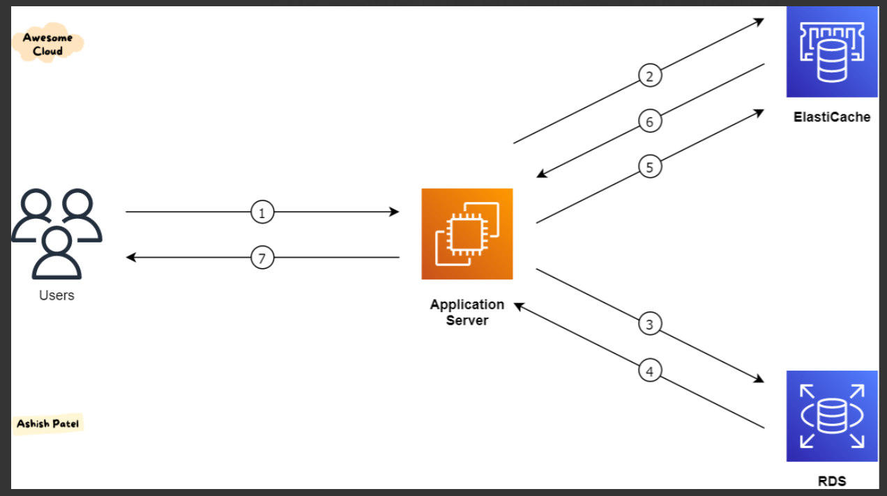

# AWS Caching: Amazon ElastiCache & MemoryDB

Just as Amazon RDS provides managed relational databases, **Amazon ElastiCache** provides managed in-memory caching technologies like Redis and Memcached.

## 1. What is Amazon ElastiCache?

Caches are in-memory databases that deliver ultra-high performance and sub-millisecond latency. The primary goal of ElastiCache is to reduce the load on your primary databases (like RDS) for read-intensive workloads.

* **Managed Service Benefits:** AWS handles OS patching, optimizations, setup, configuration, monitoring, failure recovery, and backups.
* **Application Code Changes Required:** Unlike an RDS Proxy or a load balancer, ElastiCache is not a transparent service. You must modify your application logic to query the cache before hitting the primary database.


---

## 2. ElastiCache Architecture Strategies

### A. Database Caching (Cache-Aside Pattern)

The goal is to relieve read pressure from your RDS database by caching common queries.

1. **The Cache Hit:** The application queries ElastiCache. If the data is there, it is returned instantly, saving a trip to the database.
2. **The Cache Miss:** The application queries ElastiCache, but the data is missing. The application then fetches the data from the RDS database, returns it to the user, and **writes the data back to the cache** so the next request results in a hit.

* *Challenge:* You must build a **cache invalidation strategy** to ensure stale data is deleted and only the most current data is served to users.

### B. User Session Store (Stateless Applications)

To make an application truly stateless (allowing it to scale horizontally behind a load balancer), user sessions shouldn't be stored on individual web servers.

* When a user logs in, the application writes their session data directly to ElastiCache.
* If the user is redirected to a completely different EC2 instance on their next request, that new instance simply retrieves the session state from ElastiCache, keeping the user seamlessly logged in.

---

## 3. ElastiCache Engines: Redis vs. Memcached

AWS offers two different caching engines. While they are both fast, they have fundamentally different architectures.

| Feature | ElastiCache for Redis | ElastiCache for Memcached |
| --- | --- | --- |
| **High Availability** | Yes (Multi-AZ with Auto-Failover) | No (No replication, no failover) |
| **Architecture** | Replicated nodes (Primary/Replica) | Partitioned nodes (Sharding) |
| **Data Durability** | Yes (AOF Persistence & Snapshots) | No (Data is lost if a node fails) |
| **Data Structures** | Advanced (Strings, Lists, Sets, Sorted Sets) | Simple (Key-Value only) |
| **Multi-Threading** | No (Single-threaded) | Yes (Multi-threaded) |

* *Note:* Sorted Sets in Redis make it incredibly easy to build real-time gaming leaderboards.

---

## 4. Amazon MemoryDB for Redis

While ElastiCache for Redis is designed primarily as a *cache* (where temporary data loss is acceptable), **Amazon MemoryDB for Redis** is built to be a primary, durable database.

* **What it is:** A fully managed, Redis-compatible, durable in-memory database service.
* **Performance:** Delivers ultra-fast performance with over 160 million requests per second.
* **The Key Difference:** MemoryDB utilizes a Multi-AZ transaction log. Data is stored durably across multiple Availability Zones, ensuring high availability and fast recovery with zero data loss.
* **Use Cases:** Web and mobile apps, online gaming, media streaming, and microservices that require the speed of Redis but the strict durability of a primary database.

---

> 💡 **Practical Developer Tip (Python / Boto3)**
> When managing caching infrastructure through Python, you often need to programmatically locate your ElastiCache endpoints to inject them into your application's environment variables. Here is how to securely fetch your Redis cluster details:

```python
import boto3

elasticache = boto3.client('elasticache', region_name='us-east-1')

# The ID of your Redis Cluster
cluster_id = 'my-production-redis'

try:
    response = elasticache.describe_cache_clusters(
        CacheClusterId=cluster_id,
        ShowCacheNodeInfo=True
    )
    
    # Extract the connection endpoint for the first node
    node = response['CacheClusters'][0]['CacheNodes'][0]
    address = node['Endpoint']['Address']
    port = node['Endpoint']['Port']
    
    print(f"🚀 Cache configuration found!")
    print(f"Redis Connection String: {address}:{port}")

except Exception as e:
    print(f"❌ Failed to fetch ElastiCache endpoints: {e}")

```

---

## Interview Preparation: ElastiCache & MemoryDB

### Summary

In the exam or interviews, look for keywords like "relieve read pressure on the database," "in-memory caching," or "store session state." These instantly point to ElastiCache. If the scenario demands strict data durability and a Multi-AZ transaction log alongside Redis compatibility, the answer is MemoryDB.

### Q&A Details

**Q1: We are building an application that tracks users' shopping carts. The development team wants to ensure that if an EC2 instance is terminated, the user doesn't lose the items in their cart. They also want this data retrieved with sub-millisecond latency. How should we architect this?**
**Answer:** The application should be made stateless by storing the shopping cart (session data) in **Amazon ElastiCache for Redis**. By storing the session state in a centralized, low-latency cache, any EC2 instance can retrieve the cart data instantly, ensuring a seamless user experience even if web servers scale in or out.

**Q2: A gaming company needs to implement a real-time leaderboard that updates instantly for millions of concurrent users. Which AWS service is the best fit?**
**Answer:** **Amazon ElastiCache for Redis**. Redis natively supports advanced data structures like "Sorted Sets," which are specifically designed to handle real-time leaderboards and ranking systems with ultra-low latency. Memcached does not support these advanced data types.

**Q3: We are migrating a microservices architecture that relies heavily on Redis. The current on-premises Redis cluster is used not just as a cache, but as the primary system of record for critical application data. We cannot risk any data loss during a failover. Which AWS service should we choose?**
**Answer:** **Amazon MemoryDB for Redis**. Because Redis is being used as the primary database rather than a disposable cache, ElastiCache is not appropriate as it can experience data loss during node failures. MemoryDB provides the Redis-compatible API the application expects, but backs it with a highly durable, Multi-AZ transaction log to guarantee zero data loss.