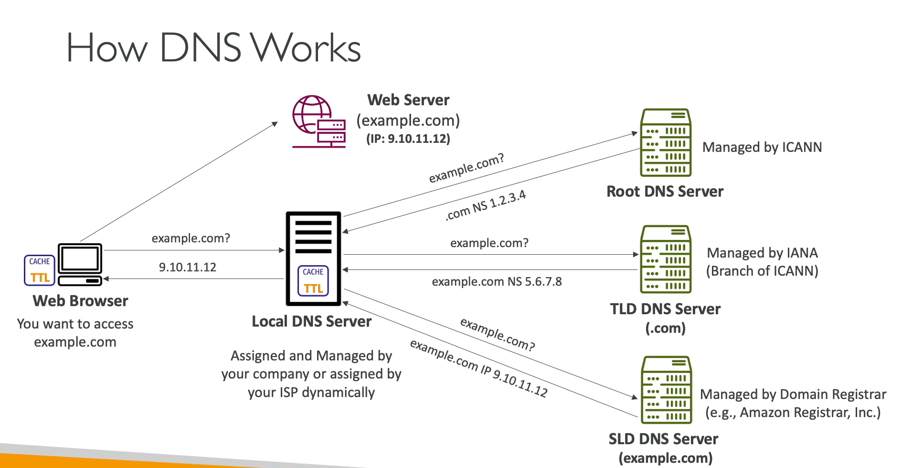

## 1. The Core Concept: What is DNS?

**DNS (Domain Name System)** is the backbone of the internet.

To understand it simply: Computers only understand numbers (IP Addresses, like `9.10.11.12`). Humans are terrible at remembering numbers, but great at remembering names (like `google.com`).
DNS is the internet's **phonebook**. It translates human-friendly hostnames into machine-readable IP addresses.

When you type `[www.google.com](https://www.google.com)` into your browser, the DNS system works behind the scenes to find the exact IP address of the server hosting that website.

## 2. The Hierarchical Structure of a Domain

To understand how DNS resolves an IP, we must first understand how a domain name is structured. It is read from right to left, and it is strictly hierarchical.

Let's break down this URL: `[http://api.www.example.com](http://api.www.example.com).`

Notice the "invisible" dot at the very end.

* **. (The Root):** The absolute top of the hierarchy. Every domain technically ends with a dot, representing the root servers.
* **.com (Top Level Domain - TLD):** Categorizes domains (e.g., `.com`, `.org`, `.net`, `.in`). These are managed by the Internet Assigned Numbers Authority (IANA).
* **example (Second Level Domain - SLD):** The specific brand or name you register (e.g., through GoDaddy or AWS Route 53).
* **www / api (Subdomain):** Prefixes you create to route traffic to specific servers or services within your domain.
* **api.www.example.com. (FQDN):** The Fully Qualified Domain Name. This represents the complete, absolute path to a specific host.

---

## 3. The DNS Resolution Process (Step-by-Step)

This is the core concept often tested in network engineering interviews. How exactly does your computer find `9.10.11.12` when you type `example.com`?

It uses a process called a **Recursive Query**. Think of it as a chain of delegations where servers ask other servers for directions until they find the final answer.

Let's walk through the exact sequence when you try to access `example.com`:

### Step 1: The Local DNS Server (The Recursive Resolver)

Your computer asks its configured **Local DNS Server** (usually provided dynamically by your ISP or company network):

> *"Hey, what is the IP address for `example.com`?"*

If the Local DNS has the answer in its cache, it replies immediately. If not (a Cache Miss), it begins the recursive hunt on your behalf.

### Step 2: Querying the Root Server

The Local DNS server doesn't know where `example.com` is, so it asks one of the 13 **Root DNS Servers** managed globally by ICANN:

> *"Do you know the IP for `example.com`?"*

The Root server responds:

> *"I don't know the exact IP, but I see it ends in `.com`. You need to talk to the `.com` Top-Level Domain server. Here is the IP address for the `.com` TLD server."*

### Step 3: Querying the TLD Server

The Local DNS server now asks the **TLD Server** (managing all `.com` domains):

> *"Do you know the IP for `example.com`?"*

The TLD server responds:

> *"I don't know the exact IP for the web server, but I know who manages the `example.com` domain. Here is the IP address of the Authoritative Name Server for `example.com`."*

### Step 4: Querying the Authoritative Name Server

The Local DNS server finally contacts the **Authoritative Name Server**. This is the server where the domain owner actually created their DNS records (e.g., a server managed by AWS Route 53 or GoDaddy).

> *"Do you have the 'A Record' (IPv4 address) for `example.com`?"*

The Authoritative server responds:

> *"Yes, I manage that domain. The IP address for `example.com` is `9.10.11.12`."*

### Step 5: Caching and Final Delivery

1. The Local DNS server receives `9.10.11.12`.
2. It **caches** this answer for a specific duration (defined by the Time-to-Live or TTL) so it doesn't have to repeat Steps 2-4 if someone else asks for it.
3. It hands the IP address back to your web browser.
4. Your browser makes the actual HTTP request to the web server at `9.10.11.12`.

---

## 4. Interview Preparation: DNS Concepts

When preparing for cloud or networking roles, interviewers want to see that you understand the mechanics of this resolution process and what happens when it breaks.

### Q&A Details

**Q1: A user complains they cannot reach our company website (`[www.mycompany.com](https://www.mycompany.com)`), but they can reach it if they type the direct IP address (`198.51.100.45`) into their browser. What is the most likely cause?**
**Answer:** The issue is unequivocally a DNS resolution failure. Because the user can reach the server via its direct IP, the network path and the web server itself are functioning correctly. The user's Local DNS resolver is failing to translate the hostname into the IP address, possibly due to a misconfigured A record on our Authoritative Name Server, or a caching issue at the ISP level.

**Q2: In the DNS resolution process, what is the difference between a Recursive DNS Server and an Authoritative DNS Server?**
**Answer:** A Recursive Server (like your ISP's local DNS or Google's 8.8.8.8) acts as a middleman; it accepts queries from clients and does the heavy lifting of traversing the DNS hierarchy (Root -> TLD -> Authoritative) to find the answer. An Authoritative Server, however, holds the actual, final DNS records (like the A or CNAME records) for a specific domain. It does not ask other servers for answers; it provides the final truth.

**Q3: We recently updated the IP address for our main web server in our DNS records. However, some users around the world are still being routed to the old IP address, while others are hitting the new one. Why is this happening?**
**Answer:** This is caused by DNS caching and the Time-to-Live (TTL) setting. When the Local DNS servers previously resolved the old IP address, they cached that result for the duration specified by the TTL. Users hitting the old IP are querying Local DNS servers whose cache has not yet expired. Once the TTL expires, those servers will query our Authoritative Name Server again and receive the new IP address.