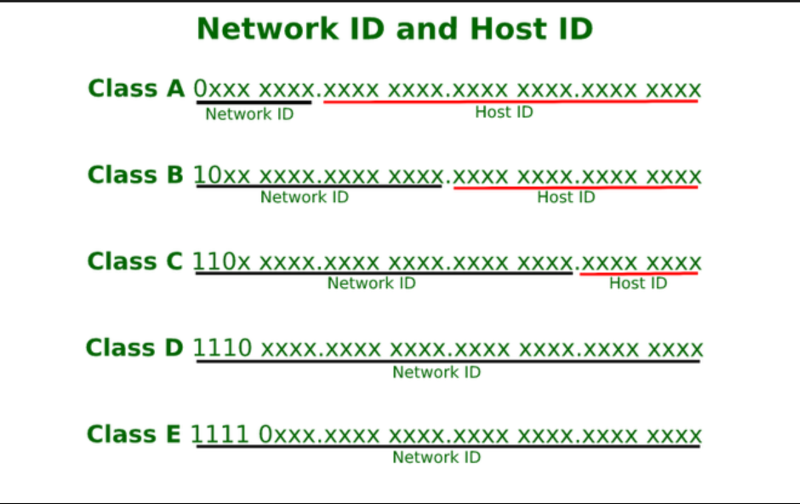
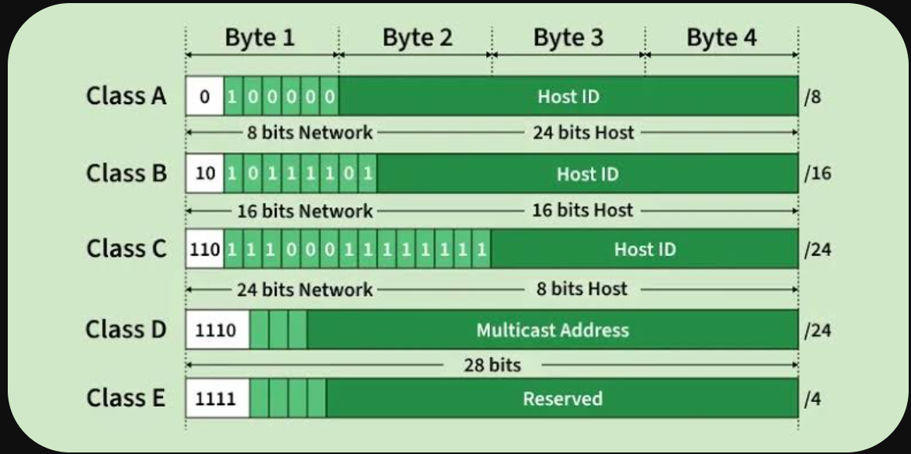

# 🌐 Computer Networks: IP Address, Subnetting & Supernetting (Classful Addressing)

**Video Title:** CN | IP address Subnetting Supernetting | Introduction to Computer network and IP address | RBR
**Instructor:** Prof. Ravindrababu Ravula
**Video Link:** [YouTube URL](https://www.youtube.com/watch?v=UXMIxCYZu8o)

---

## 1. How Computer Networks Work: An Example [[00:01](https://www.google.com/search?q=https%3A%2F%2Fwww.youtube.com%2Fwatch%3Fv%3DUXMIxCYZu8o%26t%3D1)]

To understand how things actually work in a computer network, let's take a practical example:

- **Scenario:** You are using your computer (Host) on a network in India (e.g., Airtel Network). You open a browser (Process) and type `[www.google.com](https://www.google.com)`.
- **Target:** Google's server (Host) on Google's network in California, USA, specifically the web server (Process) on Port 80.

### 🛣️ The Three-Step Delivery Process:

To fetch a webpage, your request has to route correctly in three steps [[01:48](https://www.google.com/search?q=https%3A%2F%2Fwww.youtube.com%2Fwatch%3Fv%3DUXMIxCYZu8o%26t%3D108)]:

1. **Destination Network:** Request must reach the target network (Google's Network in California).
2. **Destination Host:** Request must reach the specific target server within that network.
3. **Destination Process:** Request must reach the exact running application (e.g., HTTP Web Server).

### 🔍 Translating the Domain Name (DNS Overhead) [[04:26](https://www.google.com/search?q=https%3A%2F%2Fwww.youtube.com%2Fwatch%3Fv%3DUXMIxCYZu8o%26t%3D266)]

When you type `[www.google.com](https://www.google.com)`, the computer cannot route using text. It needs numbers (IP Addresses).

- **DNS (Domain Name System):** The ISP provides a DNS server. Before contacting Google, your computer asks the DNS server, _"What is the IP address of google.com?"_
- **Port Numbers:** IP addresses help you reach the Network and the Host, but to reach the exact _process_, you need a **Port Number**. For HTTP web services, this is globally fixed at **Port 80** [[03:30](https://www.google.com/search?q=https%3A%2F%2Fwww.youtube.com%2Fwatch%3Fv%3DUXMIxCYZu8o%26t%3D210)]. Other examples include FTP (21) and SMTP (25).

---

## 2. Number Systems Refresher [[06:37](https://www.google.com/search?q=https%3A%2F%2Fwww.youtube.com%2Fwatch%3Fv%3DUXMIxCYZu8o%26t%3D397)]

Before diving into IP addressing, a quick recap of number systems:

| Number System   | Base (n) | Symbols Used                             | Example             |
| --------------- | -------- | ---------------------------------------- | ------------------- |
| **Unary**       | 1        | `0` (Used in Abacus. E.g., '3' is `000`) | `00` (represents 2) |
| **Binary**      | 2        | `0, 1`                                   | `101`               |
| **Octal**       | 8        | `0, 1, 2, 3, 4, 5, 6, 7`                 | `73`                |
| **Decimal**     | 10       | `0` through `9`                          | `15`                |
| **Hexadecimal** | 16       | `0-9` and `A-F` (A=10, B=11... F=15)     | `1F`                |

> **Pro Tip for Computer Science [[08:50](https://www.google.com/search?q=https%3A%2F%2Fwww.youtube.com%2Fwatch%3Fv%3DUXMIxCYZu8o%26t%3D530)]:** Memorize powers of 2.
>
> - $2^{10} = 1024$ (Represented as **K**)
> - $2^{20} = 1024 \times 1024$ (Represented as **M** - Million)

### Splitting Address Spaces [[11:00](https://www.google.com/search?q=https%3A%2F%2Fwww.youtube.com%2Fwatch%3Fv%3DUXMIxCYZu8o%26t%3D660)]

If you have a binary address space of $n$ bits, the total number of items is $2^n$.

- If you lock down (choose) **1 bit**, you divide the space into **2 parts**.
- If you lock down **2 bits**, you divide the space into **4 parts**.
- If you lock down **$k$ bits**, you get **$2^k$ networks**, and the size of each part is **$2^{n-k}$**.

---

## 3. IPv4 Addressing Overview [[15:04](https://www.google.com/search?q=https%3A%2F%2Fwww.youtube.com%2Fwatch%3Fv%3DUXMIxCYZu8o%26t%3D904)]

An IP address is a **32-bit number**. Total IP addresses possible = $2^{32}$.

Initially (e.g., ARPANET), they split the 32 bits straight into:

- **8 bits** for Network ID ($2^8 = 256$ networks).
- **24 bits** for Host ID ($2^{24} = 16$ million hosts per network).

**Problem:** Only 256 networks was fine in the 1970s, but extremely unscalable today [[16:19](https://www.google.com/search?q=https%3A%2F%2Fwww.youtube.com%2Fwatch%3Fv%3DUXMIxCYZu8o%26t%3D979)]. Also, no one except NASA or the Pentagon needs 16 million hosts in a single network.

This led to the creation of **Classful IP Addressing**.

## 

## 4. Classful IP Addressing [[17:26](https://www.google.com/search?q=https%3A%2F%2Fwww.youtube.com%2Fwatch%3Fv%3DUXMIxCYZu8o%26t%3D1046)]

To scale properly, the 32-bit space was divided by analyzing leading bits (prefix codes). The address is usually shown in **Dotted Decimal Representation** (e.g., splitting 32 bits into 4 octets of 8 bits each, separated by dots) [[25:25](https://www.google.com/search?q=https%3A%2F%2Fwww.youtube.com%2Fwatch%3Fv%3DUXMIxCYZu8o%26t%3D1525)].

### 🅰️ Class A [[27:29](https://www.google.com/search?q=https%3A%2F%2Fwww.youtube.com%2Fwatch%3Fv%3DUXMIxCYZu8o%26t%3D1649)]

- **Prefix:** Starts with `0`.
- **Structure:** 8 bits for Network ID, 24 bits for Host ID.
- **Calculation:** Since the first bit is fixed as `0`, 7 bits remain for the Network ID ($2^7 = 128$ networks).
- **Hosts per Network:** $2^{24}$ (approx. 16 million).
- **First Octet Range:** `00000000` (0) to `01111111` (127).
- **Practical Range:** **1 to 126** [[31:33](https://www.google.com/search?q=https%3A%2F%2Fwww.youtube.com%2Fwatch%3Fv%3DUXMIxCYZu8o%26t%3D1893)]
- _Note: `0` and `127` are not used for normal network assignment (127 is for loopback testing)._

```text
Class A Format: [ 0 | Network (7) ] . [ Host (8) ] . [ Host (8) ] . [ Host (8) ]

```

### 🅱️ Class B [[32:42](https://www.google.com/search?q=https%3A%2F%2Fwww.youtube.com%2Fwatch%3Fv%3DUXMIxCYZu8o%26t%3D1962)]

Designed for mid-sized organizations (like banks: SBI, IRCTC).

- **Prefix:** Starts with `10`.
- **Structure:** 16 bits for Network ID, 16 bits for Host ID.
- **Calculation:** First 2 bits fixed, leaving 14 bits for Network ID ($2^{14} \approx 16,000$ networks).
- **Hosts per Network:** $2^{16}$ (65,536 hosts).
- **First Octet Range:** `10000000` (128) to `10111111` (191).
- **Practical Range:** **128 to 191** [[36:32](https://www.google.com/search?q=https%3A%2F%2Fwww.youtube.com%2Fwatch%3Fv%3DUXMIxCYZu8o%26t%3D2192)]

```text
Class B Format: [ 10 | Network (14 bits across 2 octets) ] . [ Host (16) ]

```

### ©️ Class C [[39:27](https://www.google.com/search?q=https%3A%2F%2Fwww.youtube.com%2Fwatch%3Fv%3DUXMIxCYZu8o%26t%3D2367)]

Designed for small offices and smaller colleges.

- **Prefix:** Starts with `110`.
- **Structure:** 24 bits for Network ID, 8 bits for Host ID.
- **Calculation:** First 3 bits fixed, leaving 21 bits for Network ID ($2^{21} \approx 2$ million networks).
- **Hosts per Network:** $2^8 = 256$ hosts.
- **First Octet Range:** `11000000` (192) to `11011111` (223).
- **Practical Range:** **192 to 223** [[42:49](https://www.google.com/search?q=https%3A%2F%2Fwww.youtube.com%2Fwatch%3Fv%3DUXMIxCYZu8o%26t%3D2569)]

### 🅳 Class D [[44:22](https://www.google.com/search?q=https%3A%2F%2Fwww.youtube.com%2Fwatch%3Fv%3DUXMIxCYZu8o%26t%3D2662)]

Class D is **not divided** into Network and Host IDs. It is reserved for **Multicasting**.

- **Prefix:** Starts with `1110`.
- **Total IPs:** $2^{28}$ (approx. 256 million addresses).
- **First Octet Range:** `11100000` (224) to `11101111` (239).
- **Practical Range:** **224 to 239** [[45:32](https://www.google.com/search?q=https%3A%2F%2Fwww.youtube.com%2Fwatch%3Fv%3DUXMIxCYZu8o%26t%3D2732)]

> **Instructor's Note [[47:58](https://www.google.com/search?q=https%3A%2F%2Fwww.youtube.com%2Fwatch%3Fv%3DUXMIxCYZu8o%26t%3D2878)]:** Reserving $2^{28}$ addresses for multicasting turned out to be a huge disadvantage/waste. Even today, the world uses less than 1,000 active multicast groups, yet 256 million addresses are trapped here.

### 🅴 Class E [[45:41](https://www.google.com/search?q=https%3A%2F%2Fwww.youtube.com%2Fwatch%3Fv%3DUXMIxCYZu8o%26t%3D2741)]

Reserved for experimental/military purposes. Not used for general host allocation.

- **Prefix:** Starts with `1111`.
- **First Octet Range:** **240 to 255**.

## 

## 5. Important Formula: Usable Hosts vs Total IPs [[46:12](https://www.google.com/search?q=https%3A%2F%2Fwww.youtube.com%2Fwatch%3Fv%3DUXMIxCYZu8o%26t%3D2772)]

Even if a network mathematically has $N$ addresses, you cannot assign all of them to hosts. You must always **subtract 2** from the total IP addresses available in a network block to get the number of configurable hosts.

**Usable Hosts = Total IPs - 2**

- _The first IP address is the Network ID itself._
- _The last IP address is the Directed Broadcast Address (broadcasting to the network)._

**Example Summary:**

| Class | Total IPs Available | Configurable Hosts    |
| ----- | ------------------- | --------------------- |
| **A** | $2^{24}$            | $2^{24} - 2$          |
| **B** | $2^{16}$ (65,536)   | $2^{16} - 2$ (65,534) |
| **C** | $2^8$ (256)         | $2^8 - 2$ (254)       |

---

Here are detailed GitHub-flavored Markdown notes derived from the second video in the series, maintaining the exact analogies, examples, and formatting style requested.

# 🌐 Computer Networks: Types of Casting (Unicast, Limited & Directed Broadcast)

**Video Title:** CN | IP address Subnetting | Types of Casting: Unicast,
**Video Link:** [YouTube URL](https://www.youtube.com/watch?v=hffYt7RDrgk)

---

## 1. Introduction to Casting [[00:01](https://www.google.com/search?q=https%3A%2F%2Fwww.youtube.com%2Fwatch%3Fv%3DhffYt7RDrgk%26t%3D1)]

**Casting** is the method of sending a packet from one host to other host(s). The two major ways to do this in IPv4 are:

1. **Unicast:** Sending a packet from one host to _only one_ particular host (One-to-One).
2. **Broadcast:** Sending a packet from one host to _many_ hosts (One-to-All).

---

## 2. Unicasting [[00:15](https://www.google.com/search?q=https%3A%2F%2Fwww.youtube.com%2Fwatch%3Fv%3DhffYt7RDrgk%26t%3D15)]

Unicasting is a standard one-to-one communication.

### 📝 Example Scenario [[00:38](https://www.google.com/search?q=https%3A%2F%2Fwww.youtube.com%2Fwatch%3Fv%3DhffYt7RDrgk%26t%3D38)]:

- **Source Network:** `11.0.0.0` (Class A)
- **Source Host IP:** `11.1.2.3`

- **Destination Network:** `20.0.0.0` (Class A)
- **Destination Host IP:** `20.1.2.3`

When the host `11.1.2.3` wants to send a message _only_ to `20.1.2.3`:

1. It creates a packet.
2. It sets the **Source Address** to `11.1.2.3`.
3. It sets the **Destination Address** to `20.1.2.3`.
4. The packet routes directly to that single machine.

> **Key Rule [[01:53](https://www.google.com/search?q=https%3A%2F%2Fwww.youtube.com%2Fwatch%3Fv%3DhffYt7RDrgk%26t%3D113)]:** Why is the network ID `20.0.0.0` and not assigned to a host? Whenever you have **all zeroes** in the Host ID part of an IP address, it represents the _entire network_. This is why the first IP address of any block or subnet can never be configured on a single machine.

---

## 3. Broadcasting [[03:23](https://www.google.com/search?q=https%3A%2F%2Fwww.youtube.com%2Fwatch%3Fv%3DhffYt7RDrgk%26t%3D203)]

Broadcasting means one host sends a message to multiple hosts simultaneously. If you want to send data to everyone, sending 16 million individual unicast packets (in a Class A network) would crash your hardware and software. Instead, we use special IP addresses to trigger a broadcast.

There are two types of broadcasting: **Limited** and **Directed**.

### 🔒 A. Limited Broadcasting [[03:46](https://www.google.com/search?q=https%3A%2F%2Fwww.youtube.com%2Fwatch%3Fv%3DhffYt7RDrgk%26t%3D226)]

**Definition:** A host sends a message to _all other hosts_ within its **OWN** network.

**How it works:**

- Let's say Host `11.1.2.3` wants to send a packet to every other machine inside the `11.0.0.0` network.
- The host creates a packet:
- **Source IP:** `11.1.2.3`
- **Destination IP:** **All 1s** in binary (32 bits of 1s).

- Encoded into Dotted Decimal, 32 bits of 1s equals: `255.255.255.255`.

> **Important [[06:24](https://www.google.com/search?q=https%3A%2F%2Fwww.youtube.com%2Fwatch%3Fv%3DhffYt7RDrgk%26t%3D384)]:** `255.255.255.255` is a universally reserved address for Limited Broadcasting. If a router/switch sees this as the destination, it duplicates and delivers the packet to every single host on that local network. It can never be assigned to a specific computer.

### 🎯 B. Directed Broadcasting [[06:48](https://www.google.com/search?q=https%3A%2F%2Fwww.youtube.com%2Fwatch%3Fv%3DhffYt7RDrgk%26t%3D408)]

**Definition:** A host in one network wants to send a message to _all hosts_ in a **DIFFERENT** network.

**How it works [[07:46](https://www.google.com/search?q=https%3A%2F%2Fwww.youtube.com%2Fwatch%3Fv%3DhffYt7RDrgk%26t%3D466)]:**

- Let's say Host `11.1.2.3` (Network 11) wants to broadcast a message to everyone inside the `20.0.0.0` network.
- It cannot use `255.255.255.255` because that would only broadcast inside its own `11.0.0.0` network.
- Instead, it creates a packet:
- **Source IP:** `11.1.2.3`
- **Destination IP:** A combination of the target **Network ID** + **All 1s** in the Host ID part.

- Since Network 20 is Class A (8 bits Network, 24 bits Host), we keep `20` and set the remaining 24 bits to 1s.
- **Destination IP becomes:** `20.255.255.255`.

When the packet reaches the router for Network 20, the router sees the all-1s in the Host ID part and distributes it to every machine inside that network.

---

## 4. Why We Subtract 2 from Total Hosts [[09:51](https://www.google.com/search?q=https%3A%2F%2Fwww.youtube.com%2Fwatch%3Fv%3DhffYt7RDrgk%26t%3D591)]

As discussed in the previous notes, you can never use all $2^n$ IP addresses for hosts. We must always subtract exactly 2 addresses from any network block. We now have the exact terminology for _why_:

1. **Network ID (All 0s in Host part):** Used to represent the network itself.
2. **Directed Broadcast Address (All 1s in Host part):** Used to broadcast to everyone in that network.

| Class | Total IPs available per network | Configurable Hosts per network |
| ----- | ------------------------------- | ------------------------------ |
| **A** | $2^{24}$                        | $2^{24} - 2$                   |
| **B** | $2^{16}$                        | $2^{16} - 2$                   |
| **C** | $2^8$                           | $2^8 - 2$                      |

---

## 5. Practical Problem Solving: Identifying Addresses [[11:08](https://www.google.com/search?q=https%3A%2F%2Fwww.youtube.com%2Fwatch%3Fv%3DhffYt7RDrgk%26t%3D668)]

The instructor provided several examples to practice finding the Network ID, Directed Broadcast Address (DBA), and Limited Broadcast Address (LBA) given a random IP.

_Reminder of ranges: Class A (1-126), Class B (128-191), Class C (192-223)._

| Given IP Address | Class                     | Network ID                       | Directed Broadcast Address (DBA)       | Limited Broadcast Address (LBA) |
| ---------------- | ------------------------- | -------------------------------- | -------------------------------------- | ------------------------------- |
| **1.2.3.4**      | **A** _(starts with 1)_   | `1.0.0.0` _(Host part = all 0s)_ | `1.255.255.255` _(Host part = all 1s)_ | `255.255.255.255`               |
| **10.0.0.0**     | **A** _(starts with 10)_  | `10.0.0.0`                       | `10.255.255.255`                       | `255.255.255.255`               |
| **130.1.0.0**    | **B** _(starts with 130)_ | `130.1.0.0`                      | `130.1.255.255`                        | `255.255.255.255`               |
| **150.0.0.0**    | **B** _(starts with 150)_ | `150.0.0.0`                      | `150.0.255.255`                        | `255.255.255.255`               |
| **200.1.10.100** | **C** _(starts with 200)_ | `200.1.10.0`                     | `200.1.10.255`                         | `255.255.255.255`               |
| **220.15.1.0**   | **C** _(starts with 220)_ | `220.15.1.0`                     | `220.15.1.255`                         | `255.255.255.255`               |

### ❌ Invalid Examples [[15:38](https://www.google.com/search?q=https%3A%2F%2Fwww.youtube.com%2Fwatch%3Fv%3DhffYt7RDrgk%26t%3D938)]:

- **250.x.x.x:** Falls into **Class E**. Class E does not have a Network ID or Host ID separation, so concepts like DBA do not apply.
- **300.1.2.3:** Not a valid IP address. An octet is 8 bits, meaning the maximum decimal value is `255`.
